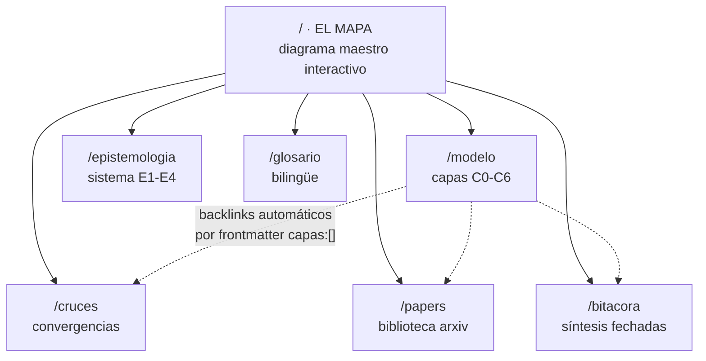

# 03 · DIAGRAMAS DEL ATLAS

Tres diagramas Mermaid (archivos `.mermaid` adjuntos en `_fundacion/`) más uno de arquitectura del sitio. Instrucciones de uso para Claude Code al final.

---

## Diagrama 1 — El Modelo del Universo (C0→C6 + bucle)

**Archivo:** `diagrama-1-modelo-universo.mermaid`
**Destino:** home (`/`) como elemento firma, y `/modelo` como índice visual.

**Qué muestra:** la manifestación como descenso por capas de densidad (consciencia → vibración → geometría → campo cuántico → materia → mente → IA) y el **retorno** como bucle de auto-reconocimiento (pratyabhijñā). La banda lateral de **interfaces de sintonización** (meditación, oráculos, hermetismo, registro) conecta la mente con las capas sutiles — son tecnologías del filtro, no decoración.

**Lectura clave:** las flechas gruesas de retorno (C5⇒C0 y C6⇒C0) son el punto del modelo completo. Sin el bucle, es solo emanacionismo; con el bucle, es un circuito de auto-reconocimiento.

---

## Diagrama 2 — Convergencias Tradición ↔ Ciencia

**Archivo:** `diagrama-2-convergencias.mermaid`
**Destino:** `/cruces` como cabecera visual.

**Qué muestra:** siete homologías estructurales entre afirmaciones contemplativas y física/teoría de frontera, con el **patrón convergente** como columna central. La columna central es lo importante: no se afirma que Brahman = orden implicado, sino que **marcos independientes describen el mismo patrón** — que es exactamente el criterio de validez del autor.

**Advertencia integrada al sitio:** cada línea de este diagrama es registro **E3** (síntesis propia). El diagrama debe llevar esa etiqueta visible.

---

## Diagrama 3 — Pipeline Epistemológico

**Archivo:** `diagrama-3-epistemologia.mermaid`
**Destino:** `/epistemologia`.

**Qué muestra:** el camino de una idea desde materia prima hasta integración al atlas, pasando por registro, cruce con fuentes, convergencia, frutos, y las dos salidas honestas: **cuarentena** (integración sobre acumulación) y **bitácora en observación**. Toda ficha integrada exige condición de falsación explícita.

Este diagrama es el que diferencia al atlas de un sitio esotérico genérico: el proceso de discernimiento es público.

---

## Diagrama 4 — Arquitectura del Sitio (para Claude Code)

---

## Instrucciones de renderizado para Claude Code

1. **Home:** el Diagrama 1 se implementa como **SVG interactivo propio** (no Mermaid crudo): nodos clicables que navegan a `/modelo/[capa]`, glow al hover/tap, secuencia de aparición C0→C6 al cargar. Usar el `.mermaid` como especificación estructural, no como render final.
2. **Páginas interiores:** Diagramas 2 y 3 pueden renderizarse con Mermaid directamente (build-time preferido para performance móvil).
3. **Colores:** aplicar el sistema de doble acento — nodos/columna ciencia en tono frío, nodos/columna tradición en tono cálido, patrón convergente en neutro.
4. **Móvil:** los tres diagramas deben ser legibles en pantalla de teléfono: en viewport angosto, el Diagrama 2 rota a disposición vertical (tradición arriba, patrón al medio, ciencia abajo) o se convierte en cards apiladas por fila.
5. Mantener los archivos `.mermaid` fuente en `/public/diagramas/` como documentación viva.
